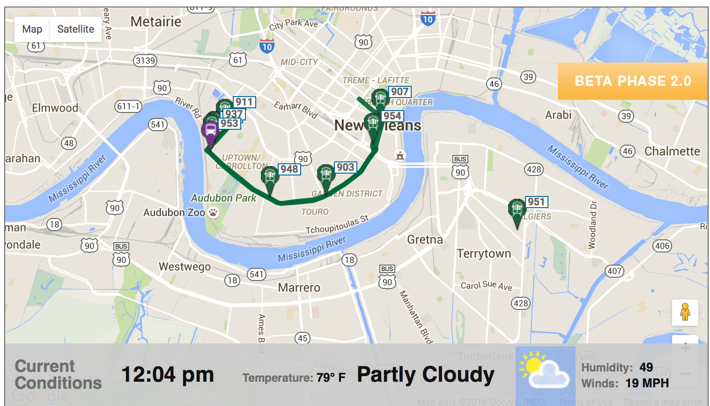
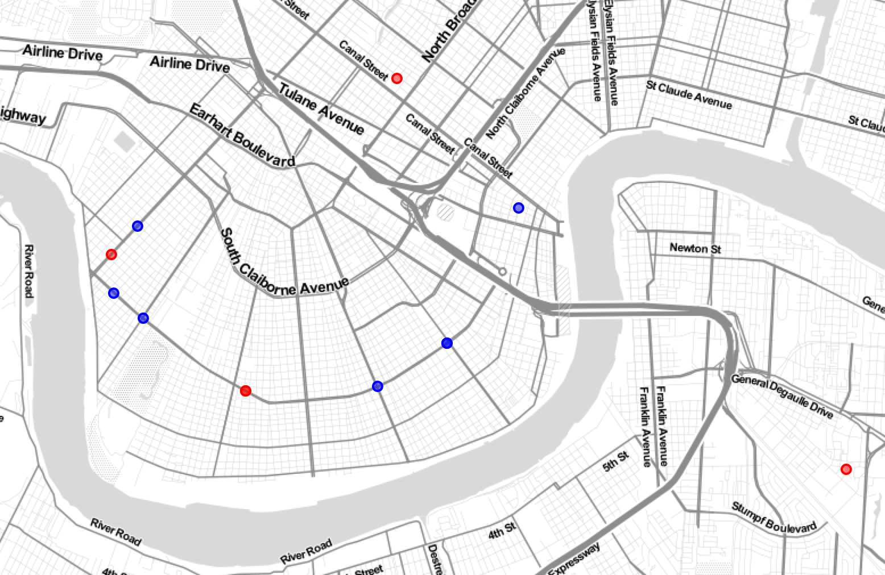
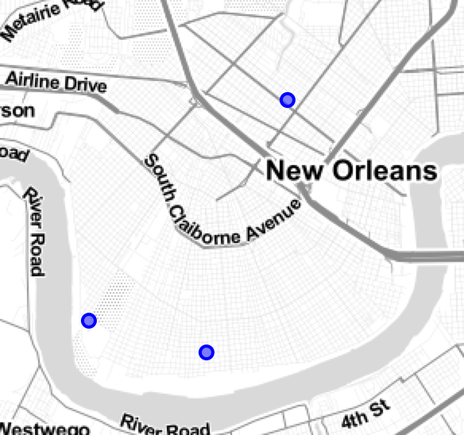
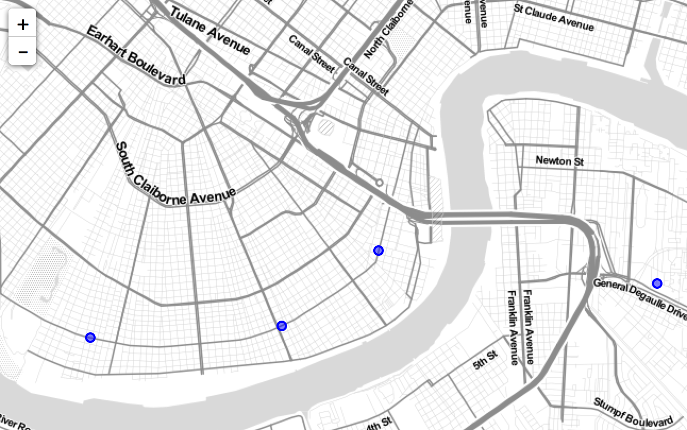

# NORTA Realtime API Documentation

I've requested documentation for the Realtime Data API but NORTA claims that they do not have any documentation and
none of their vendors seem to need it. I think it's impossible to build something solid on top of an API without
documentation so I've started this document as a place to share our knowledge about the API and hopefully
build better systems around it.

## Contributing

This is a living document. If you know anything about this system, I implore you to share your thoughts on how
to make this better. Please [file an issue](https://github.com/bhelx/norta-data/issues/new) or send a pull request
if you'd like to contribute to this document.

## Requesting Access

In order to get access to the API, you are going to need to jump through a few hoops.
First sign up for a MyRTA account on the NORTA site [http://www.norta.com/](http://www.norta.com/).
There are two types of information you can get (please let me know if these urls change):

1. [Data Subscription](https://ecommerce.norta.com/MyRTA/DataSubscription.aspx)
2. [Realtime Data](http://www.norta.com/Rider-Tools/Estimated-Arrival-Information-and-Real-Time-Map.aspx)

The `Data Subscription` is a folder with [GTFS](https://developers.google.com/transit/gtfs/reference#feed-files)
formatted data on things like routes, schedules, and stops. I'm going to be making a separate document for that.

The `Realtime Data` is an HTTP/XML service for accessing realtime locations of the streetcars and buses. You *must* download
the `Data License Agreement` and fill it out. I would suggest using Adobe Reader or Google Docs to fill it out.
It's a lot easier than printing it, completing it by hand, then scanning it back into pdf. Next click on
`Requesting Instructions` and you will be shown a pdf with instructions on where to submit your form.
All it tells you to do is attach the signed pdf to an email and wait for a response. Every time I've done this,
I've had to follow up on the email a few times so I'd suggest you don't just send it and forget it. Keep sending follow up emails.

As an aside, I would love to have a lawyer look at the agreement. It has a lot of vague language related to licensing
tech back in the day when software was physically shipped and owned. I'm not confident I understand it's implications.

## API Documentation

Once they have completed your account, they will email you a url and an API key in the form:

```
http://gpsinfo.norta.com/?key=<your_api_key>
```

### Routes / Parameters

As far as I can tell, only the root path `/` is supported and the `key` GET param is the only param on that route.
There are no other actions you can request. I remember the API used to have more parameters and support ETAs but
it seems to have changed. Please let me know if you know of other parameters or actions.

### Response Data

The responses are in xml format only and return that way automatically. When the API is operating normally,
you will get HTTP `200` responses and an xml response body that looks something like this:

```xml
<?xml version="1.0" encoding="UTF-8"?>
<unitlist>
  <unit>
    <iterator>0</iterator>
    <route>2</route>
    <rt_name>'Riverfront'</rt_name>
    <name>457</name>
    <lat>2955.050729</lat>
    <lng>-9001.232522</lng>
    <bearing>1.607448</bearing>
    <car_type>'RTA Street Cars'</car_type>
    <speed>22.4402</speed>
    <GMT>201314</GMT>
    <train>1</train>
  </unit>
  <unit>
    <iterator>1</iterator>
    <route>2</route>
    <rt_name>'Riverfront'</rt_name>
    <name>462</name>
    <lat>2957.342511</lat>
    <lng>-9003.771049</lng>
    <bearing>2.509784</bearing>
    <car_type>'RTA Street Cars'</car_type>
    <speed>0</speed>
    <GMT>180929</GMT>
    <train>2</train>
  </unit>
  <!-- Usually around 50-90 more 'unit' tags -->
</unitlist>
```

The xml does not make use of the `type` attribute so we must infer what types were intended. Obviously `unitlist` is an array type.
Each `unit` refers to a vehicle (streetcar or bus). Let's break down what is in a `unit`. I'm going to describe each field
then we can break down the more mysterious ones.

```xml
<unit>
  <iterator>9</iterator>
  <route>12</route>
  <rt_name>'St. Charles'</rt_name>
  <name>953</name>
  <lat>2957.193511</lat>
  <lng>-9004.233783</lng>
  <bearing>-0.8988445</bearing>
  <car_type>'RTA Street Cars'</car_type>
  <speed>0</speed>
  <GMT>180922</GMT>
  <train>12</train>
</unit>
```

* `iterator` *int* I believe just refers to the zero-based index into the unitlist array. I don't think it's useful.
* `route` *int* refers to the NORTA route number (12 in this case is the St Charles Streetcar line)
* `rt_name` *string* is the human name for the route as a string. Notice the single quotes.
* `name` *int* refers to the vehicle id. Should be unique to each vehicle but may not be unique in list (see Duplicate Readings section)
* `lat` *float* refers to the latitude point
* `lng` *float* refers to the longitude point
* `bearing` *float* refers to the direction the vehicle is travelling
* `car_type` *string* refers to the type of vehicle ['RTA Buses' or 'RTA Street Cars']
* `speed` *float* refers to the speed of the vehicle (I believe in miles per hour, need to verify)
* `GMT` *string* refers to the time in GMT that the reading was taken. Looks like an int but is actually a string.
* `train` *int* I believe this refers to the "position" of the vehicle on the route. Will be unique to a vehicle per route. Still some mystery here.

### Parsing Location Fields

Figuring out the lat/lng format was one of the most frustrating parts. It's immediately obvious that they are not in
an industry standard projection like [WGS84](https://en.wikipedia.org/wiki/World_Geodetic_System) so you can't use
them in mapping software (Google Maps or Leaflet for instance) as is. I initially thought it was EPSG:3452, a Louisiana specific projection I had encountered
while working with [crime data](https://github.com/bhelx/in-the-heat-of-the-night/blob/master/nola_data_etl.py#L9-L14).
But after reprojecting the results were skewed. I wrote a script to brute force every projection and check if the
results were in New Orleans and they all failed. I was baffled. Fortunately, I was able to reach out to
[Joel Carranza](https://github.com/joelcarranza/) who I knew previously had some experience with the data.
He explained that it's some kind of custom DMS type format but described in *D*egrees and *M*inutes. Here is an example
of the longitude and latitude from above:

```
 DDMM.MMMMMM
-----.------
-9004.233783
 2957.193511
```

Here is the formula you'd use to convert this to WGS84 in python.
(I'm using python throughout this document because I find it is like pseudocode and has mass adoption):

```python
import math

def sign(val):
  """Returns -1.0 for val < 0 and 1.0 for val >= 0"""
  return math.copysign(1, val)

def convert_to_wgs84(coord):
  """Takes the DMS coordinate and returns WGS84 coordinate"""
  degrees = math.floor(abs(coord / 100.0))
  minutes = abs(coord) - (degrees * 100.0)

  return sign(degrees) * (degrees + (minutes / 60.0))

print convert_to_wgs84(2955.445186)  #  29.924086433333333
print convert_to_wgs84(-9005.305311) # -90.08842185
```

I would resist the urge to treat this as a string and break it up using a regex or something.
The reason is that they treat it as a float on their side so it may not come right-padded with zeros.
Thus you can't guarantee that they will always be the same length. The best
way to separate the degrees and minutes is as I've done above by multiplying and diving by 100.
Please let me know if you have better suggestions.

### Parsing Last Reading (GMT field)

This is another non-standard field but I was able to figure it out after lots of guessing. This field causes way more problems
than it should. I believe it was a major mistake to make this a `Time` instead of a `DateTime` (more on that later).
Here is the format:

```
HHMMSS
------
180922
```

So this value is `18:09:22 GMT`. It's a 24 hour based time. I would suggest trying to parse this as
a string this time and *NOT* as an integer. The only reason being that I think I've seen some 5 digit numbers come through
(not left zero padded) and you'll want a case for that and in this case, the regex pattern seems less fragile.
I could be convinced with some better code. Here is some python code to parse it:

```python
import re

def parse_time_components(gmt_val):
  """Parses out time components from gmt_string"""

  # just in case the left padded zero is missing
  if len(gmt_val) == 5:
    return parse_time_components("0" + gmt_val)

  # consider returning some kind of default and logging an alert
  assert len(gmt_val) == 6

  match = re.match("(\d{2})(\d{2})(\d{2})", gmt_val)

  if match:
    # convert from strings to ints
    # [hours, minutes, seconds]
    return map(int, match.groups())
  else:
    # decide what to do if the pattern doesn't match
    # you should alert the value somewhere and let us know what it was :)
    return None

print parse_time_components("180922")  # [18, 9, 22]
print parse_time_components("080922")  # [8, 9, 22]
print parse_time_components("80922")   # [8, 9, 22]
```

## Anomalies

#### Stale Readings and the problem with the GMT field

As I mentioned before, the GMT field represents a `Time` value and not a `DateTime` value. Because of this, we don't know which day
this reading was taken. This is a problem for two reasons:

1. Midnight GMT is 7PM CST. So you are often going to have to deal with a day rollover.
2. Some readings are quite stale and can get stuck for days. If this was a full `DateTime` it would be
   easy to detect that and throw away the reading. Because there is no date, you can't determine which day
   the reading was actually taken.

To demonstrate this point, I noticed this St Charles line street car (number `951`) that had a stale reading:

```xml
<unit>
  <iterator>13</iterator>
  <route>12</route>
  <rt_name>'St. Charles'</rt_name>
  <name>951</name>
  <lat>2955.050729</lat>
  <lng>-9001.232522</lng>
  <bearing>1.607448</bearing>
  <car_type>'RTA Street Cars'</car_type>
  <speed>22.4402</speed>
  <GMT>201314</GMT>
  <train>8</train>
</unit>
```

It turns out it's been stuck like this for days and that location is somewhere in Algiers. Even the NORTA site falls prey to this
issue:



Also, a less obvious and even worse case: streetcar `948` has also been stuck in it's position by Jefferson since I've seen it.

```xml
<unit>
  <iterator>15</iterator>
  <route>12</route>
  <rt_name>'St. Charles'</rt_name>
  <name>948</name>
  <lat>2955.666688</lat>
  <lng>-9006.677576</lng>
  <bearing>3.586652</bearing>
  <car_type>'RTA Street Cars'</car_type>
  <speed>0</speed>
  <GMT>190135</GMT>
  <train>14</train>
</unit>
```

You don't have any data to indicate that these readings are stale. They often still have speed and bearing for instance. We need
a way to *guess* what the day is so we can find these stale records.

My current process for detecting a stale record is this. This is still a work in progress. I will convert to python later when this goes public.

```elixir
@stale_time 600 # seconds, 10 minutes

def parse_gmt_time(time) do
  case Regex.run(~r/(\d{2})(\d{2})(\d{2})/, time) do
    [_time, hour, min, sec] ->
      # Parse hour, minute, second
      {hour, _} = Integer.parse(hour)
      {min, _} = Integer.parse(min)
      {sec, _} = Integer.parse(sec)

      # Take the current time in GMT
      current_gmt = DateTime.now("Etc/GMT")
      # Take the current local time (Central)
      current_local = DateTime.now("America/Chicago")
      # set the hour, min, sec on the current GMT (preserves the day which may be tomorrow)
      reported_gmt = DateTime.set(current_gmt, hour: hour, minute: min, second: sec)

      # This reading may have happened yesterday (from the perspective of GMT)
      # give ourselves a window of 10 minutes by reprojecting it to yesterday.
      if reported_gmt.hour == 23 && current_gmt.hour == 0 && current_gmt.minute < @stale_time / 60.0 do
        reported_gmt = reported_gmt |> DateTime.shift(days: -1)
      end

      # convert to local time
      DateTime.local(reported_gmt)
    _ ->
      nil
  end
end

reported_local = parse_gmt_time(vehicle.gmt)

# if it's a future date or diff is larger than the @stale_time (600 seconds)
stale = DateTime.compare(reported_local, DateTime.local) > 0 || DateTime.diff(DateTime.local, reported_local) > @stale_time
formatted_time = Formatter.format!(reported_local, "{ISO}")

%{vehicle | stale: stale, time: formatted_time}
```

After you mark a vehicle as stale, you'll want to keep that state somewhere. There is at least one window a day where it
may seem valid. You'll want to reach into your set of stale records and compare it to the seemingly valid reading.

After applying this method, you'll see that there are a ton of stale readings (in red). Here is a random sample of
readings for the #12 Street Car line:



It's probably best to not show these to your users. It's my opinion that it's better to not show a vehicle that may be there,
than it is to show one that is definitely not.

#### Offline Readings

On top of stale readings, you will find readings coming from vehicles that are not technically in service.
I believe this is because the buses start reporting their coordinates as soon as the busguard cameras turn
on. Here is a reading of a #11 bus parked at the RTA station.



I can't think of a great way around this. One thought was use the GTFS routes and calculate the distance of the vehicle
from the nearest point on it's designated route. Establish some threshold that allows you to determine that the vehicle
is either coming on or going off service. One other simple heuristic would be to geofence the RTA station. That would
take care of at least some readings.

#### Duplicate Readings on multiple routes

Sometimes a vehicle name is not unique in the list. This happens when it's tracking on multiple routes. Consider these
two buses:

```xml
<unit>
  <iterator>75</iterator>
  <route>108</route>
  <rt_name>'Algiers Local'</rt_name>
  <name>245</name>
  <lat>2955.848535</lat>
  <lng>-9002.387225</lng>
  <bearing>1.64061</bearing>
  <car_type>'RTA Buses'</car_type>
  <speed>0</speed>
  <GMT>171808</GMT>
  <train>3</train>
</unit>

<unit>
  <iterator>7</iterator>
  <route>11</route>
  <rt_name>'Magazine'</rt_name>
  <name>245</name>
  <lat>2955.848535</lat>
  <lng>-9002.387225</lng>
  <bearing>1.64061</bearing>
  <car_type>'RTA Buses'</car_type>
  <speed>0</speed>
  <GMT>171808</GMT>
  <train>3</train>
</unit>
```

Both are bus `245` and they are actually the same bus reporting on two routes. One is reporting on Magazine route #11, the other
on Algiers Local #108. The lat/lng is the same on both. It's in Algiers:



So a user may want to see buses on #11 Magazine and see this bus on Algiers Local.

My guess is that the source busguard API uses the GTFS data to determine which route the bus SHOULD be on. But there is
a bug and it's reporting it for two routes. One way around this might be to use the GTFS data to correct the bug and
remove the duplicate reading. This may not be possible, I'm not sure yet.

Reminder: This also means that the `<name>` tag is not always unique!

### System States and Errors

The most common failure I have seen so far is a randomly closed socket. You will want to catch your code
from blowing up and try again right away.

You may also find that sometimes the service may respond with 200 but give you empty or bad xml. You should catch
that and try again right away.

Once the RTA schedule goes offline, the system returns an empty array:

```xml
<unitlist></unitlist>
```

You may want to capture this state and inform your users that the system is offline. You might also want to stop
pinging the service to be a good neighbor. Would be interesting to know the time schedule of the service here.
It's probably in the GTFS.

### Performance Tips

#### Use "Connection: keep-alive" header

Their server does support keepalive so make sure to add your keepalive header if you don't already have it set.

```
~ben ~: curl -Iv http://gpsinfo.norta.com/?key=$NORTA_API_KEY 2>&1 | grep -i 'connection #0'
* Connection #0 to host gpsinfo.norta.com left intact
```

#### No gzip support :(

Unfortunately it looks like their their server does not have gzip enabled. Since this is mostly xml, the responses would be a lot faster.
Since they seem to be using Apache, I believe this is just a small change to their configuration file.

```
~ben ~: curl http://gpsinfo.norta.com/?key=$NORTA_API_KEY --silent --write-out "%{size_download}\n" --output /dev/null
18320
~ben ~: curl http://gpsinfo.norta.com/?key=$NORTA_API_KEY --silent -H "Accept-Encoding: gzip,deflate" --write-out "%{size_download}\n" --output /dev/null
18320
```

#### No HTTP cache headers

It also seems like they aren't making use of `Cache-Control` or `ETag` headers. In order
to reduce network traffic it's important to know when there will be new information. I am assuming
it's being updated every couple seconds but I have not figured out the exact frequency.

As far as caching on my end goes, I just take the md5 of each response. My "Fetcher" polls the data every 4 seconds and
always keeps the last md5 hash around. It prints out a log each request:

```
12:11:06.633 [info] Found 81 vehicles with hash uXsMUES+ayggBOO9X7OBbQ==
12:11:18.420 [info] Found 81 vehicles with hash W4wOoYR5Lwh5JmoDsj4Czg==
12:11:31.284 [info] md5 matched W4wOoYR5Lwh5JmoDsj4Czg==
12:11:43.222 [info] Found 81 vehicles with hash pPeGdF5wl8BHwti8I7DQKQ==
12:11:53.638 [info] md5 matched pPeGdF5wl8BHwti8I7DQKQ==
12:12:04.038 [info] md5 matched pPeGdF5wl8BHwti8I7DQKQ==
12:12:14.525 [info] Found 81 vehicles with hash ORFkB9BF6Lj+SrvNe6ivPQ==
```

Having observed it for a while. It seems they update their data every 30 seconds. How often you check depends on how bad you want a worst case scenario
read to be. I currently have it set at 4 seconds because if there is new data, I don't want to wait more than 4 seconds to find out.
I might consider cranking this up to 3 or 2. I find the closer you get to 2 the more api errors you see. They never gave me a limit or SLA so I
can't say if they are hating me for this or not.
